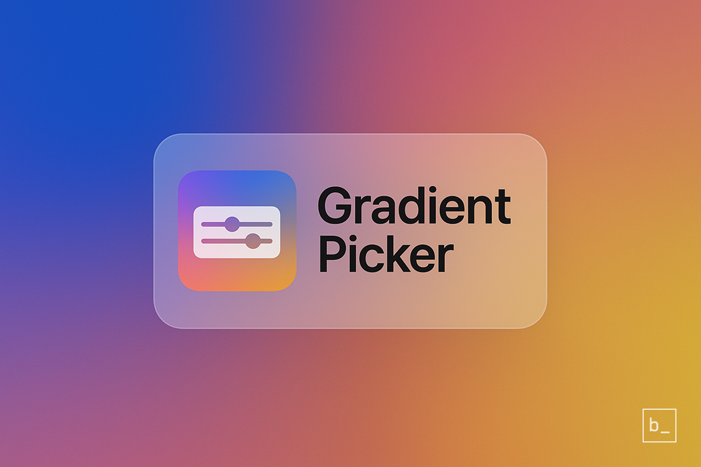
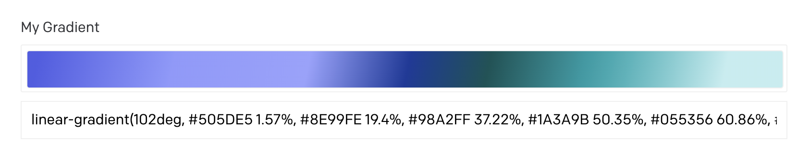
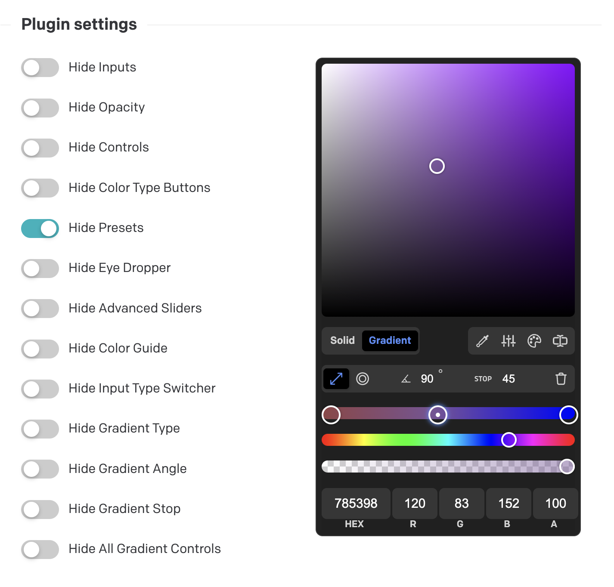

# Gradient Picker

A powerful DatoCMS plugin for creating multi-color CSS gradients with full control over colors, stops, and angles. Perfect for creating beautiful backgrounds, hero sections, and visual effects.



## Features

- **Multi-color gradients**: Add unlimited color stops to create complex, beautiful gradients
- **Full angle control**: Adjust gradient direction with precise 360° control
- **Linear and radial gradients**: Support for both gradient types with multiple patterns
- **Live preview**: See your gradient in real-time as you create it
- **CSS-ready output**: Generates clean, optimized CSS gradient strings
- **Intuitive interface**: User-friendly color picker with advanced controls
- **Highly configurable**: Customize which controls are visible to your editors

## Installation

Install the plugin from the DatoCMS Plugin Marketplace or manually via npm:

```bash
pnpm add datocms-plugin-gradient-picker
```

## Usage

### Setting up the field

1. Add the plugin to your DatoCMS project
2. In your model, add a new field (String or Text type)
3. Under "Presentation", select "Gradient Picker" as the field addon
4. Save your changes

### Creating gradients

The plugin integrates seamlessly with DatoCMS fields, adding a visual gradient preview below the native text input:



Click on the gradient preview to open the full-featured color picker where you can:
- Add and remove color stops
- Adjust colors with precision controls
- Change gradient angles and types
- Use preset gradients for quick styling
- Switch between linear and radial modes


Gradients are stored as CSS-ready strings like:
```css
linear-gradient(90deg, rgb(255,0,0) 0%, rgb(0,0,255) 100%)
```

## Configuration

Customize the picker interface to match your needs by configuring which controls are visible to your editors:



Available configuration options:
- Hide/show color input fields
- Hide/show opacity controls
- Hide/show preset gradients
- Hide/show advanced sliders
- Hide/show gradient type selector
- Hide/show angle controls
- And many more options...

## Using gradients in your code

The gradient is stored as a CSS string, making it effortless to use in your frontend:

```jsx
// In React/JSX
<div style={{ background: record.gradientField }}>
  Your content here
</div>

// In CSS-in-JS
const styles = {
  hero: {
    background: record.gradientField
  }
}

// In Next.js
<section style={{ background: data.hero.gradient }}>
  <h1>Beautiful gradient background</h1>
</section>
```

## Development

This plugin uses **pnpm v10** as the package manager.

```bash
# Install dependencies
pnpm install

# Start development server
pnpm dev

# Build for production
pnpm build
```

## License

MIT
